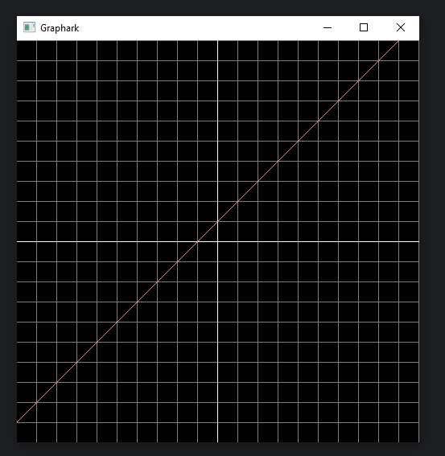
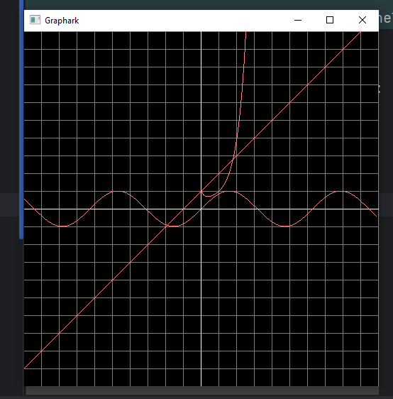

# Graphark

2d function grapher written in OpenGL.



## Usage

Place the binary `Graphark` in the same directory as `shaders/` and execute it, you may use the `-h` flag to get help on
its syntax.

```
running_dir/
    Graphark.exe
    shaders/
        vertex.glsl
        fragment.glsl
```

```shell
Graphark [OPTIONS] functions


POSITIONALS:
  functions TEXT REQUIRED     Functions to graph separated by comma

OPTIONS:
  -h,     --help              Print this help message and exit
```

Some example valid values for `functions`:

- `x`
- `sin(x)`
- `x^x`
- `x,x+1`
- `x,x^x,sin(x)`



> [!NOTE]
> You can use the arrow keys, `-` and `=` to zoom and pan the graph.
